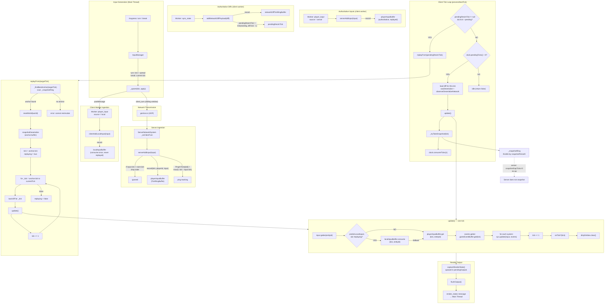

# Input & Replay Management — Mermaid Diagram

## 1.  Input Flow (Player → Server → Simulation)

## 2.  Key Semantics

| Concept | Implementation |
|---|---|
| **Tick points to "next to process"** | It is safe to queue inputs and events for `room.tick` because they are consumed during the `tick → tick+1` transition inside `update()`. |
| **Two input buffers** | `localInputBuffer` holds client-predicted inputs; consumed once with `consume()` and **never** replayed. `playerInputBuffer` holds authoritative server inputs; read with `get()` and **is** replayed during rollback. |
| **Sliding window retransmission** | `InputManager` sends the full buffered window of inputs every frame so UDP packet loss is healed automatically by the next datagram. |
| **Diff → Replay chain** | When a `sync_state` arrives, `addNetworkDiffPayload` schedules a resimulation at `diff.tick - 1`. The next `processNextTick` triggers `replayFrom`, rewinding to the nearest snapshot and replaying forward with stored diffs and inputs. |
| **Snapshot ring** | `_snapshotRing` stores periodic full-world snapshots. During replay the best anchor (most recent snapshot ≤ target tick) is chosen, bounding replay distance. |
| **Same-tick events** | `gameEventBuffer` stores events per tick; all systems in that tick's iteration see the same event list. Events are non-consuming (read but not removed). |
