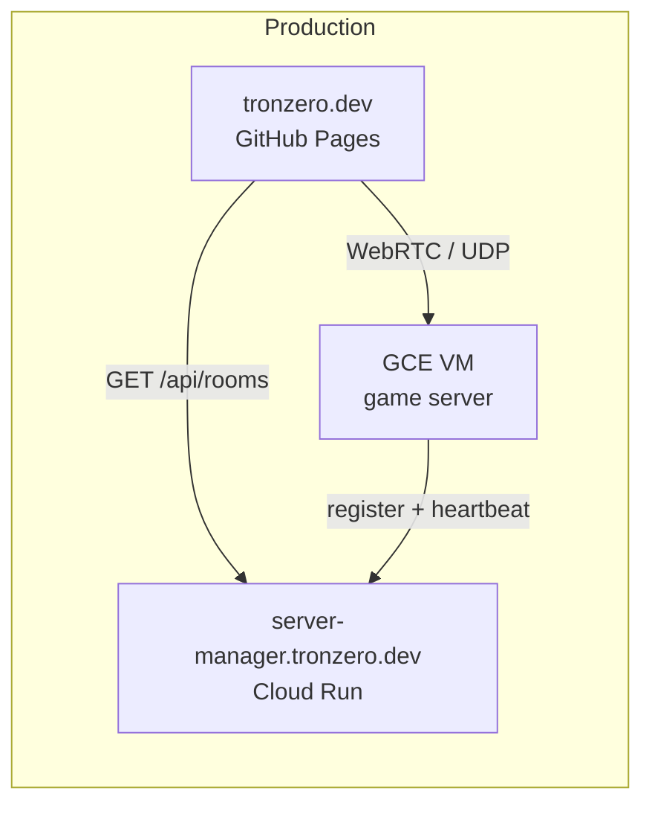

# Release and Deploy

This guide covers CI/CD for the **client** (GitHub Pages) and **server-manager** (Cloud Run). The **game server** still runs on a GCE VM because it needs UDP/WebRTC — see [DEPLOYMENT.md](../DEPLOYMENT.md) for that.

## Architecture

| Component | Local (`bun run dev`) | Production |
|-----------|----------------------|------------|
| Client | `http://localhost:8080` | `https://tronzero.dev` (GitHub Pages) |
| Server-manager | `http://localhost:3001` | `https://server-manager.tronzero.dev` (Cloud Run, `europe-west1`) |
| Game server | `http://localhost:3000` | GCE VM external IP (WebRTC/UDP) |



Local dev is unchanged: copy `.env.template` to `.env` and run `bun run dev`. Production URLs are injected only in GitHub Actions at build/deploy time.

## Workflows

| Workflow | Trigger | What it does |
|----------|---------|--------------|
| [`ci.yml`](../.github/workflows/ci.yml) | PRs and pushes to `main` | Typecheck + prod client build (no deploy) |
| [`server-manager-docker.yml`](../.github/workflows/server-manager-docker.yml) | PRs touching server-manager | Docker build + `/health` smoke test |
| [`release-please.yml`](../.github/workflows/release-please.yml) | Push to `main` | Opens/updates a Release PR |
| [`deploy-release.yml`](../.github/workflows/deploy-release.yml) | GitHub Release published | Deploys client + server-manager |

## How releases work

Releases are driven by [release-please](https://github.com/googleapis/release-please). Merging a normal feature PR does **not** cut a release.

1. Merge PRs to `main` using [Conventional Commits](https://www.conventionalcommits.org/):
   - `feat:` → minor bump
   - `fix:` → patch bump
   - `feat!:` or `BREAKING CHANGE:` → major bump
2. release-please opens a **Release PR** (e.g. `chore(main): release 1.1.0`) that bumps `package.json`, `.release-please-manifest.json`, and `CHANGELOG.md`.
3. **Merge the Release PR** → GitHub Release + git tag are created.
4. `deploy-release.yml` runs automatically and deploys both services.

To cut a release manually without waiting for commits, run the **release-please** workflow from the Actions tab (`workflow_dispatch`).

## GitHub environments

Do **not** delete the `github-pages` environment. GitHub creates it when Pages is enabled, and the deploy workflow requires it.

| Environment | Used by | Purpose |
|-------------|---------|---------|
| `github-pages` | `deploy-client` job | Client deploy to GitHub Pages |
| `production` | `deploy-server-manager` job | Server-manager deploy to Cloud Run |

### Pages source

**Settings → Pages → Build and deployment → Source:** set to **GitHub Actions** (not “Deploy from a branch”).

If you previously deployed from a `gh-pages` branch, switch the source to GitHub Actions. You do not need to delete the `github-pages` environment.

Optional: add required reviewers on the `production` environment to gate Cloud Run deploys.

## One-time GitHub setup

### Repository variable

**Settings → Secrets and variables → Actions → Variables**

| Name | Example value |
|------|---------------|
| `VITE_MANAGER_URL` | `https://server-manager.tronzero.dev` |

Used when building the client in CI. Falls back to `https://server-manager.tronzero.dev` if unset.

### Repository secrets

**Settings → Secrets and variables → Actions → Secrets**

| Name | Description |
|------|-------------|
| `GCP_PROJECT_ID` | `tron-zero-js` |
| `GCP_REGION` | `europe-west1` |
| `GCP_WORKLOAD_IDENTITY_PROVIDER` | Full WIF provider resource name (see below) |
| `GCP_SERVICE_ACCOUNT` | `github-deploy@tron-zero-js.iam.gserviceaccount.com` |

### Custom domain for client (GitHub Pages)

1. **Settings → Pages → Custom domain** → enter `tronzero.dev` (or `play.tronzero.dev`)
2. GitHub shows DNS records to add in Namecheap
3. For apex `tronzero.dev`, GitHub typically provides `A` records; for a subdomain, a `CNAME`

## One-time GCP setup (server-manager)

Project: **`tron-zero-js`** · Region: **`europe-west1`** · Repo: **`jeanhadrien/tron-zero-js`**

### Prerequisites

```bash
gcloud auth login
gcloud config set project tron-zero-js
```

You need Owner or IAM Admin on the project. Fetch the project number (needed for WIF):

```bash
gcloud projects describe tron-zero-js --format='value(projectNumber)'
```

Save that as `PROJECT_NUMBER` in the commands below.

### Enable APIs

```bash
gcloud services enable \
  iamcredentials.googleapis.com \
  run.googleapis.com \
  artifactregistry.googleapis.com \
  cloudresourcemanager.googleapis.com
```

### Artifact Registry

Create a Docker repository named `tron-zero` in `europe-west1`:

```bash
gcloud artifacts repositories create tron-zero \
  --repository-format=docker \
  --location=europe-west1 \
  --description="Tron Zero container images"
```

### Deploy service account

Create the service account:

```bash
gcloud iam service-accounts create github-deploy \
  --display-name="GitHub Actions deploy"
```

Grant deploy permissions:

```bash
PROJECT_ID=tron-zero-js

gcloud projects add-iam-policy-binding $PROJECT_ID \
  --member="serviceAccount:github-deploy@${PROJECT_ID}.iam.gserviceaccount.com" \
  --role="roles/run.admin"

gcloud projects add-iam-policy-binding $PROJECT_ID \
  --member="serviceAccount:github-deploy@${PROJECT_ID}.iam.gserviceaccount.com" \
  --role="roles/artifactregistry.writer"

gcloud projects add-iam-policy-binding $PROJECT_ID \
  --member="serviceAccount:github-deploy@${PROJECT_ID}.iam.gserviceaccount.com" \
  --role="roles/iam.serviceAccountUser"
```

This email goes into the `GCP_SERVICE_ACCOUNT` GitHub secret:

```
github-deploy@tron-zero-js.iam.gserviceaccount.com
```

### Workload Identity Federation (WIF)

WIF lets GitHub Actions authenticate to GCP **without a JSON key file**. GitHub exchanges an OIDC token for short-lived credentials via the provider you configure here.

#### What the two secrets mean

| Secret | What it is |
|--------|------------|
| `GCP_SERVICE_ACCOUNT` | The GCP identity GitHub impersonates to deploy |
| `GCP_WORKLOAD_IDENTITY_PROVIDER` | The full resource path of the OIDC provider that trusts GitHub tokens |

#### Step 1 — Create a Workload Identity Pool

```bash
gcloud iam workload-identity-pools create github \
  --location=global \
  --display-name="GitHub Actions"
```

#### Step 2 — Create a GitHub OIDC provider

Restrict to this repo only:

```bash
gcloud iam workload-identity-pools providers create-oidc github-provider \
  --location=global \
  --workload-identity-pool=github \
  --display-name="GitHub Actions provider" \
  --issuer-uri="https://token.actions.githubusercontent.com" \
  --attribute-mapping="google.subject=assertion.sub,attribute.actor=assertion.actor,attribute.repository=assertion.repository,attribute.repository_owner=assertion.repository_owner" \
  --attribute-condition="assertion.repository_owner=='jeanhadrien' && assertion.repository=='jeanhadrien/tron-zero-js'"
```

To also require the GitHub `production` environment (recommended — matches the deploy workflow):

```bash
  --attribute-condition="assertion.repository=='jeanhadrien/tron-zero-js' && assertion.environment=='production'"
```

If you use the environment restriction, create the **`production`** environment in GitHub first (Settings → Environments).

#### Step 3 — Allow GitHub to impersonate the service account

**Without** environment restriction:

```bash
PROJECT_ID=tron-zero-js
PROJECT_NUMBER=<your-project-number>

gcloud iam service-accounts add-iam-policy-binding \
  "github-deploy@${PROJECT_ID}.iam.gserviceaccount.com" \
  --role="roles/iam.workloadIdentityUser" \
  --member="principalSet://iam.googleapis.com/projects/${PROJECT_NUMBER}/locations/global/workloadIdentityPools/github/attribute.repository/jeanhadrien/tron-zero-js"
```

**With** `production` environment restriction:

```bash
gcloud iam service-accounts add-iam-policy-binding \
  "github-deploy@${PROJECT_ID}.iam.gserviceaccount.com" \
  --role="roles/iam.workloadIdentityUser" \
  --member="principalSet://iam.googleapis.com/projects/${PROJECT_NUMBER}/locations/global/workloadIdentityPools/github/attribute.repository/jeanhadrien/tron-zero-js/attribute.environment/production"
```

#### Step 4 — Copy the provider path into GitHub

Get the full provider resource name:

```bash
gcloud iam workload-identity-pools providers describe github-provider \
  --location=global \
  --workload-identity-pool=github \
  --format='value(name)'
```

Output looks like:

```
projects/123456789012/locations/global/workloadIdentityPools/github/providers/github-provider
```

Paste that into the `GCP_WORKLOAD_IDENTITY_PROVIDER` GitHub secret.

#### Step 5 — Verify WIF

1. Ensure all four GitHub secrets are set (see table above).
2. Create the `production` environment in GitHub if you used the environment restriction.
3. Run **Actions → deploy-release → Run workflow** manually.
4. The `deploy-server-manager` job should pass the **Authenticate to Google Cloud** step.

Reference: [google-github-actions/auth — Workload Identity Federation](https://github.com/google-github-actions/auth/blob/main/docs/README.md#workload-identity-federation).

#### WIF troubleshooting

| Error | Fix |
|-------|-----|
| `Permission denied` on auth step | Step 3 binding missing or wrong `PROJECT_NUMBER` |
| `Pool/Provider not found` | Provider path typo — use `gcloud ... describe` output exactly |
| `requested repo not allowed` | `attribute-condition` doesn't match `jeanhadrien/tron-zero-js` |
| `environment 'production' not found` | Create the `production` environment in GitHub, or remove the environment condition |
| Docker push fails | `roles/artifactregistry.writer` missing, or `tron-zero` repo doesn't exist in `europe-west1` |

### Cloud Run custom domain

Map `server-manager.tronzero.dev` to the `server-manager` service in **`europe-west1`** (domain mapping region must match the service region).

In Namecheap **Advanced DNS**:

| Type | Host | Value |
|------|------|-------|
| CNAME | `server-manager` | `ghs.googlehosted.com` |

The trailing dot in Google's UI (`ghs.googlehosted.com.`) is normal DNS notation — enter the value **without** the dot in Namecheap.

## Game server env (GCE VM)

The game server is deployed separately on a VM. Set these env vars on the VM (not in GitHub Actions):

```bash
MANAGER_URL=https://server-manager.tronzero.dev
ADVERTISED_HOST=<vm-external-ip>
SERVER_NAME=My Tron Server
MAX_PLAYERS=10
```

`ADVERTISED_HOST` must be the VM's external IP for WebRTC — not the domain.

See [DEPLOYMENT.md](../DEPLOYMENT.md) for full GCE provisioning steps.

## Manual redeploy

To redeploy without a new release:

1. Go to **Actions → deploy-release → Run workflow**
2. Optionally pass a `tag` (e.g. `v1.0.0`); otherwise the current ref is used

## Verifying a deploy

```bash
# Server-manager
curl https://server-manager.tronzero.dev/health
curl https://server-manager.tronzero.dev/api/rooms

# Client
curl -I https://tronzero.dev
```

After a game server starts on the VM, it should appear in `/api/rooms` within a few seconds.

## Troubleshooting

| Symptom | Likely cause |
|---------|--------------|
| Release PR never appears | Commits on `main` aren't conventional (`feat:`, `fix:`, etc.) |
| Pages deploy fails | Pages source not set to **GitHub Actions** |
| `github-pages` environment missing | Enable Pages in repo Settings first |
| Cloud Run deploy fails | WIF misconfigured — see [WIF troubleshooting](#wif-troubleshooting) |
| Client shows no servers | `VITE_MANAGER_URL` wrong at build time, or game server not registered |
| `DNS_PROBE_*` for manager | CNAME not propagated yet, or domain mapping in wrong region |
| HTTPS fails after DNS works | Cloud Run cert still provisioning (wait 15–30 min) |